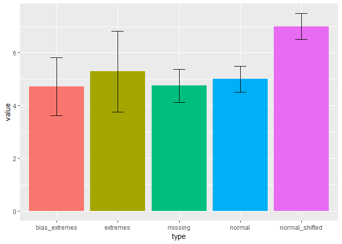
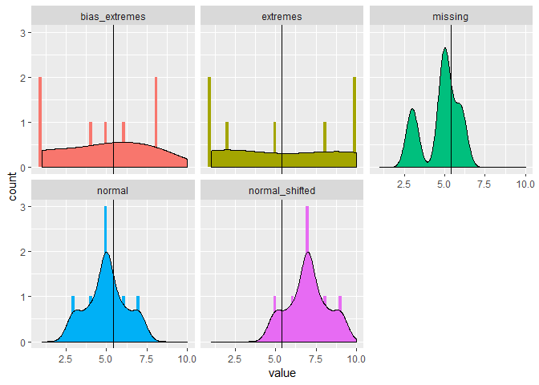
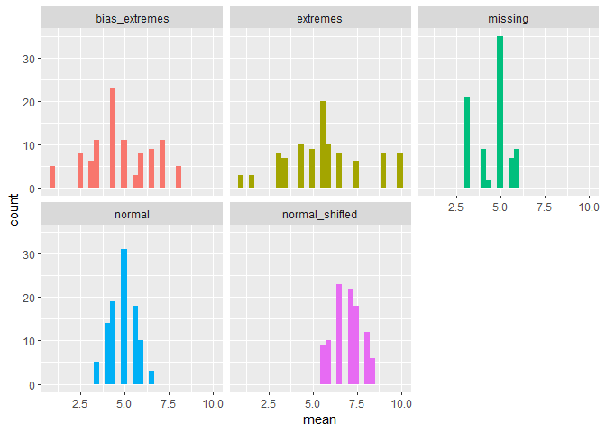
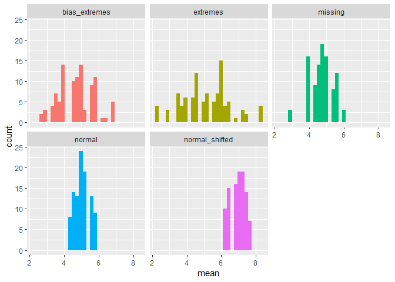

Sampling demonstration
================
Lukáš Hejtmánek
8 October 2018

Basic descriptors
=================

So in our case we have a mean 5.40625 and a following distribution.

| type            |  true\_mean|
|:----------------|-----------:|
| bias\_extremes  |    4.714286|
| extremes        |    5.285714|
| missing         |    4.750000|
| normal          |    5.000000|
| normal\_shifted |    7.000000|

looking at each separately, we get

Sampling
--------

Sampling two poker chips

Let's have a look at the means of those 100 samples of 10 percent of data 

    ## # A tibble: 5 x 2
    ##   type           true_mean
    ##   <fct>              <dbl>
    ## 1 bias_extremes       4.71
    ## 2 extremes            5.29
    ## 3 missing             4.75
    ## 4 normal              5   
    ## 5 normal_shifted      7

| type            |  min|   max|      mean|  true\_mean|
|:----------------|----:|-----:|---------:|-----------:|
| bias\_extremes  |  1.0|   8.0|  4.800000|    4.714286|
| extremes        |  1.0|  10.0|  5.650000|    5.285714|
| missing         |  3.0|   6.0|  4.524096|    4.750000|
| normal          |  3.5|   6.5|  4.925000|    5.000000|
| normal\_shifted |  5.5|   8.5|  6.950000|    7.000000|

### Sampling 4 poker chips

Let's have a look at the means of those 100 samples of 10 percent of data 

| type            |   min|   max|    mean|  true\_mean|
|:----------------|-----:|-----:|-------:|-----------:|
| bias\_extremes  |  2.75|  6.75|  4.6900|    4.714286|
| extremes        |  2.25|  8.25|  5.1450|    5.285714|
| missing         |  3.00|  6.00|  4.7050|    4.750000|
| normal          |  4.25|  5.75|  5.0175|    5.000000|
| normal\_shifted |  6.25|  7.75|  6.9800|    7.000000|
