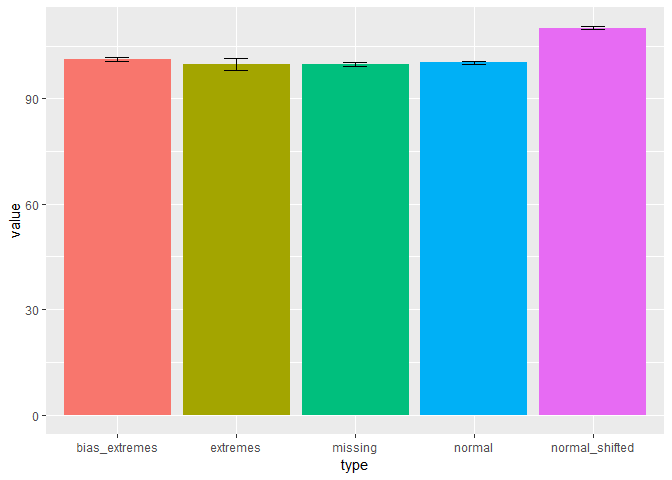
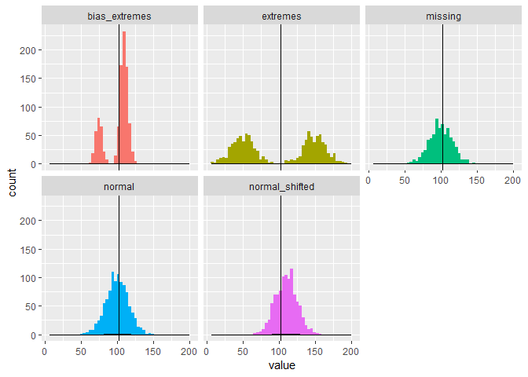
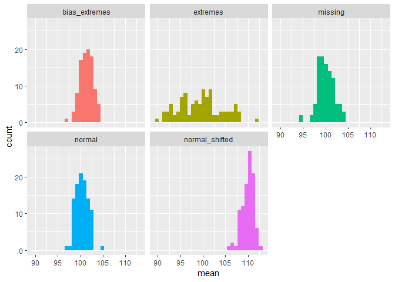
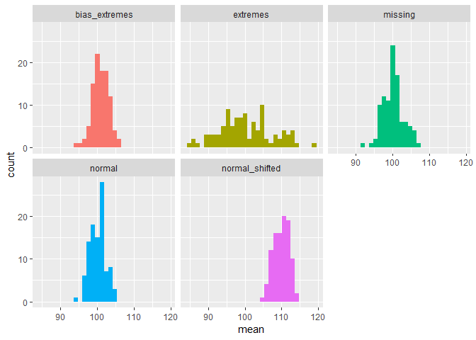

Sampling demonstration
================
Lukáš Hejtmánek
8 October 2018

Basic descriptors
=================

So in our case we have a mean 102.3962687 and a following distribution.

looking at each separately, we get the following distribution. ALL have approximate mean of 100, except normal shifted value.

Sampling
--------

### Sampling 10 percent of the sample

Sampling ten percent values. We will see what happens if we do that 100 times

Let's have a look at the means of those 100 samples of 10 percent of data 

| type            |        min|       max|       mean|  true\_mean|
|:----------------|----------:|---------:|----------:|-----------:|
| bias\_extremes  |   96.87278|  104.4223|  101.36357|   101.26762|
| extremes        |   90.15584|  112.1007|   99.56405|    99.77636|
| missing         |   94.38922|  104.4680|  100.13426|    99.86316|
| normal          |   97.17237|  104.5362|  100.39010|   100.25208|
| normal\_shifted |  106.03428|  113.1985|  110.02990|   110.06220|

Sampling 5 percent
------------------

Let's have a look at the means of those 100 samples of 10 percent of data 

| type            |        min|       max|      mean|  true\_mean|
|:----------------|----------:|---------:|---------:|-----------:|
| bias\_extremes  |   94.61538|  106.4482|  101.0304|   101.26762|
| extremes        |   84.79287|  118.9401|  100.2901|    99.77636|
| missing         |   91.67197|  106.5762|  100.2237|    99.86316|
| normal          |   94.71352|  105.3001|  100.1931|   100.25208|
| normal\_shifted |  104.60199|  113.9374|  109.9315|   110.06220|
