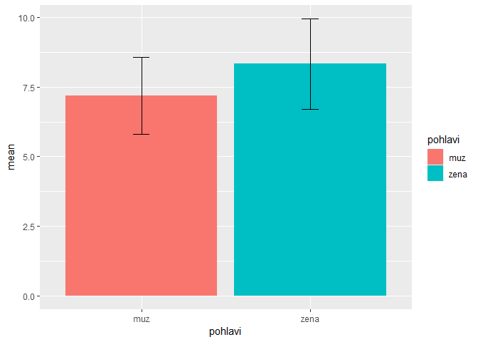
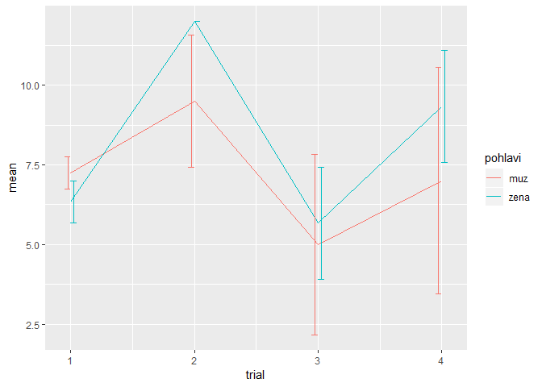
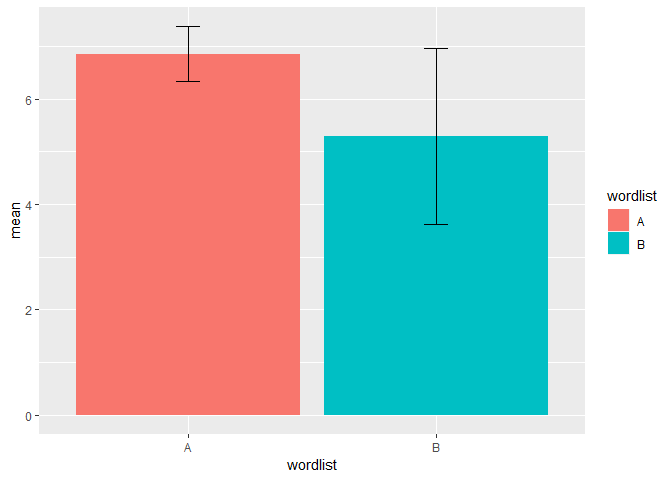

8kávas first project
================
Lukáš 'hejtmy' Hejtmánek
1 December 2018

By gender reports
-----------------

| pohlavi |  mean|    se|
|:--------|-----:|-----:|
| muz     |  7.19|  0.70|
| zena    |  8.33|  0.81|

    ## 
    ##  Welch Two Sample t-test
    ## 
    ## data:  experiment$correct by experiment$pohlavi
    ## t = -1.0724, df = 23.752, p-value = 0.2943
    ## alternative hypothesis: true difference in means is not equal to 0
    ## 95 percent confidence interval:
    ##  -3.352357  1.060690
    ## sample estimates:
    ##  mean in group muz mean in group zena 
    ##           7.187500           8.333333

By gender and trial reports
---------------------------

| pohlavi |  trial|   mean|    se|
|:--------|------:|------:|-----:|
| muz     |      1|   7.25|  0.25|
| muz     |      2|   9.50|  1.04|
| muz     |      3|   5.00|  1.41|
| muz     |      4|   7.00|  1.78|
| zena    |      1|   6.33|  0.33|
| zena    |      2|  12.00|  0.00|
| zena    |      3|   5.67|  0.88|
| zena    |      4|   9.33|  0.88|

List B vs A comparison
----------------------

| wordlist |  mean|    se|
|:---------|-----:|-----:|
| A        |  6.86|  0.26|
| B        |  5.29|  0.84|

    ## 
    ##  Welch Two Sample t-test
    ## 
    ## data:  first_exposition$correct by first_exposition$trial
    ## t = 1.7923, df = 7.1542, p-value = 0.1153
    ## alternative hypothesis: true difference in means is not equal to 0
    ## 95 percent confidence interval:
    ##  -0.4927561  3.6356132
    ## sample estimates:
    ## mean in group 1 mean in group 3 
    ##        6.857143        5.285714
