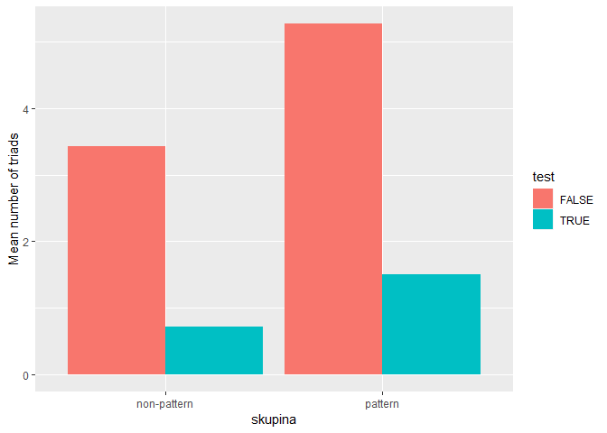
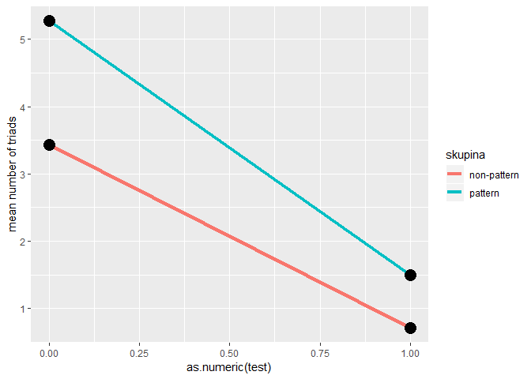
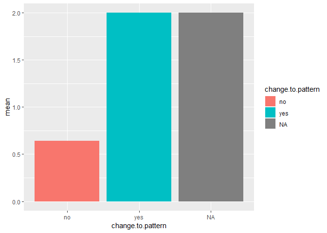

R Notebook
================

HOw?
----

So we calculate the number of "at least 3" consecutive answers in the post-training phase (23rd trial and forth). By this, we can calculate how many triads subjects did in the training phase and post and then compare if the group with the pattern did more.

The good thing is also the relative equality of the data - you have similar number of studnets in each condition. There are 22 in the pattern group and 21 group.

First thing first, let's look if the data somewhat makes sense :)



In the graph we can see that both groups correctly have the larger number of triads in the training part (trials 1-22) than in the test part. But the question is, whether there is a different "rate of decline". You can assume, that in case the pattern matching has the same effect, you would see the same "level of decline" in both cases, therefore the slope should be the same.



You can see that the slope is somewhat different, but the pattern group seems to retain the level of "patterness" despite rapid decline.

Testing for the differece between the groups, we can test for the difference between number of patterns in the "pattern" vs non-patern group by using a t-test

``` r
t.test(n_patterns ~ skupina, df_first[df_first$test == TRUE, ])
```

    ## 
    ##  Welch Two Sample t-test
    ## 
    ## data:  n_patterns by skupina
    ## t = -2.3022, df = 40.14, p-value = 0.02659
    ## alternative hypothesis: true difference in means is not equal to 0
    ## 95 percent confidence interval:
    ##  -1.47541874 -0.09600983
    ## sample estimates:
    ## mean in group non-pattern     mean in group pattern 
    ##                 0.7142857                 1.5000000

We see that there is a significant difference between the groups, with the pattern group having more patterns overall than hte non-pattern group.

Questionnarire
--------------

We can also separate the data not by "skupina", but by their answers in the questionnaire. Looking now at only the test data, we can get the following results:



So we can see that the average numebr of patterns in the test phase is different in the group that reported it.

``` r
t.test(n_patterns ~ change.to.pattern, df_first[df_first$test == TRUE, ])
```

    ## 
    ##  Welch Two Sample t-test
    ## 
    ## data:  n_patterns by change.to.pattern
    ## t = -3.5609, df = 18.411, p-value = 0.00217
    ## alternative hypothesis: true difference in means is not equal to 0
    ## 95 percent confidence interval:
    ##  -2.1565745 -0.5577112
    ## sample estimates:
    ##  mean in group no mean in group yes 
    ##         0.6428571         2.0000000

And the results are again confirmed by the t-test, with the mean in the group which "conformed" based on the questionnarire having on average 2 patterns on average, whereas the other group having 0. This difference is significant (p-value = 0.00217)
